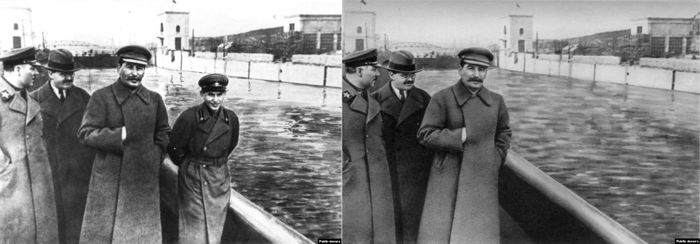
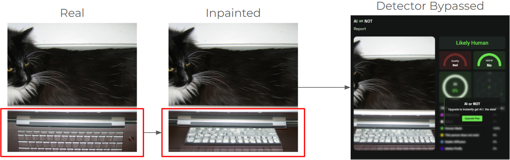
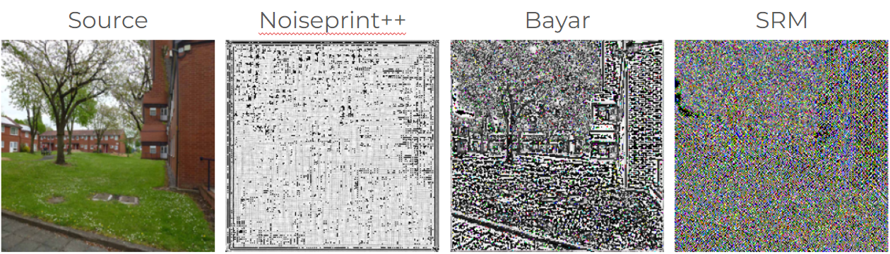

## Introduction

Image inpainting, the process of reconstructing a region in an image, has been used to manipulate information since Stalin's rule of Soviet Russia in the 1930s. Compare an original image of Stalin and Nikolai Yezhov strolling along the Moscow-Volga Canal (left), with an edited version where Yezhov has been completely removed through manual inpainting techniques (right). Image inpainting enabled Stalin to erase his enemies not just from photos, but from history.

While Stalin needed a team of artists, modern inpainting can be done within seconds. Tools such as Photoshop use advanced algorithms to fill in missing regions of an image by sampling information from the surrounding areas. Deep learning-based methods like generative adversarial networks (GANs) and diffusion models have also become more popular in recent years. Text-guided generative models like Stable Diffusion allow users to manipulate images in almost any way they see fit with a suitable text prompt. The threat of inpainting will only continue to grow as technology advances.

There are many legitimate use cases of inpainting: removing unwanted objects, repairing old or damaged photos, and editing images for creative purposes. However, it also enables the spread of misinformation. Images are often used to make news appear more credible. A fake image attached to a fake article can be a powerful tool of deception. Therefore, an effective way to identify whether an image is authentic is vital to stopping the spread of misinformation. Many tools are being developed to detect AI-generated content, but they are easily bypassed by inpainting. Rather than trying to generate a realistic image, it is far simpler for threat actors to manipulate an existing image. The inpainted regions camouflage in the real regions, becoming invisible to AI detectors.

In this project, our goal is to build a model that can not only detect whether an image has been inpainted but also identify the inpainted parts.

## Forensic Filters

High-quality inpainting tools can fill in missing regions seamlessly. In many cases, inpainting can be completely invisible. However, even if there are no visible signs of inpainting, statistical clues may be left behind. Our approach relies on the fact that an image’s statistical properties are affected when they are inpainted. Various forensic filters have been proposed to extract these properties from the raw image:

