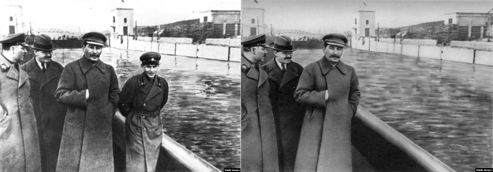

# Detecting Image Inpainting With Machine Learning

Image inpainting, the process of reconstructing a region in an image, has been used to manipulate information since Stalin's rule of Soviet Russia in the 1930s. Compare an original image of Stalin and Nikolai Yezhov strolling along the Moscow-Volga Canal (left), with an edited version where Yezhov has been completely removed through manual inpainting techniques (right). Image inpainting enabled Stalin to erase his enemies not just from photos, but from history.